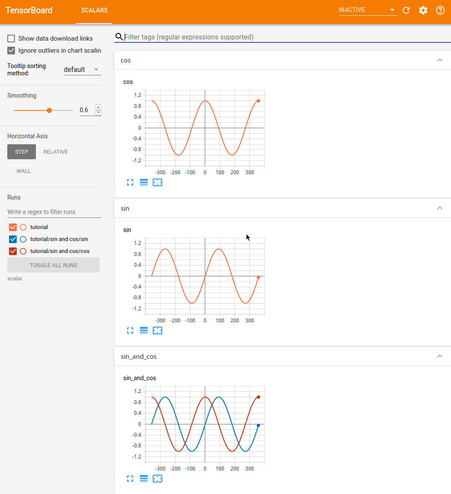
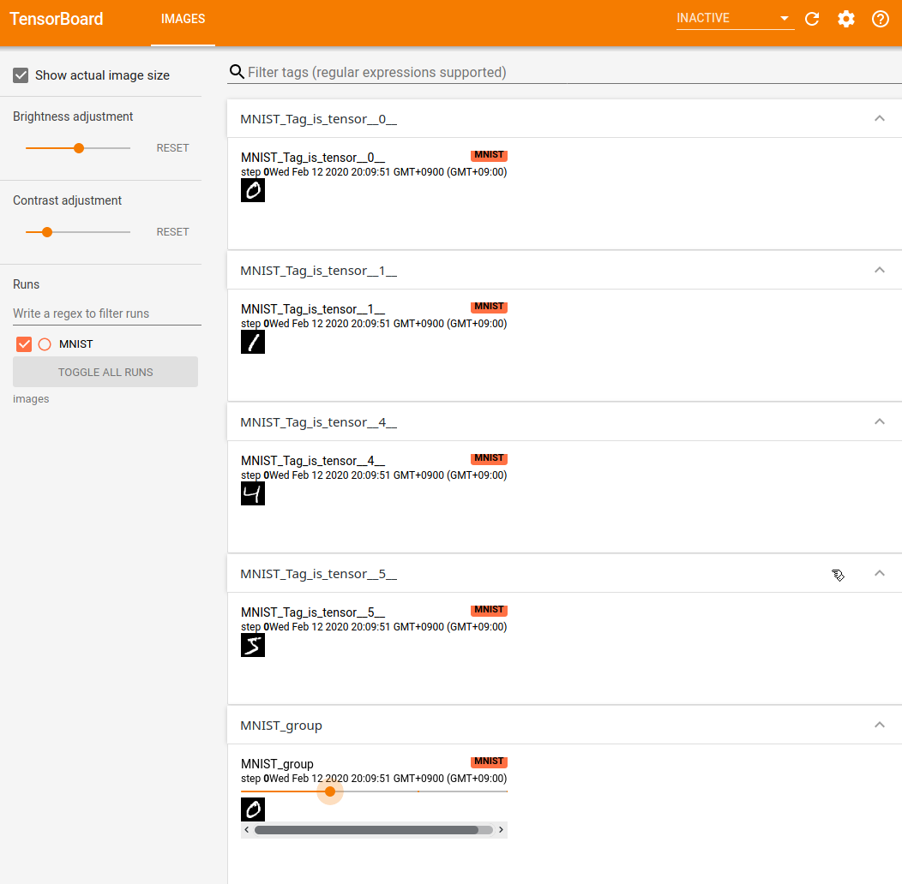
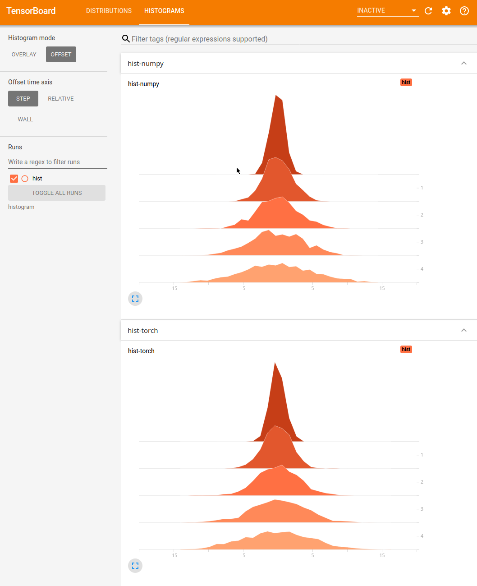

# Pytorch-tensorboard tutorial for a beginner

- [Install](##Install)
- [Hands-on](##hands-on)
  1. [Add scalar and scalars](###1.-add-scalar-and-scalars)
  2. [Add image and images](##2.-add-image-and-images)
  3. [Add histogram](##3.-add-histogram)

-----

## Install

For the first time, Tensorboard was made for tensorflow. However thanks to [awesome library](https://github.com/lanpa/tensorboardX), we can use it as tensorboardX in Pytorch too. 

You can simply install tensorboardX using pip or [github](https://github.com/lanpa/tensorboardX)

```
pip install tensorboardX
```

or

```
pip install 'git+https://github.com/lanpa/tensorboardX'
```

### Requirement

As i mentioned, tensorboard tensorflow library. Therefore to run the tensorboard in web, we need `tensorflow`.

## Hands-on

You can see full source code and data for tensorboard in my [github](https://github.com/HyoungsungKim/Pytorch-tensorboard_tutorial)

### 1. Add scalar and scalars

In this chapter, we will see how to save scalar(s) and how it will be plotted in tensorboard. ***You have to pay attention a difference of scalar and scalars.***

- scalar : It will plot just one graph
- scalars : It will plot multi graph at once

```python
import math
from tensorboarx import SummaryWriter
```

- We will draw `sin` and `cos` graph using `math` module
- You have to import SummaryWriter to use tensorboard

```python
writer = SummaryWriter(logdir='scalar/tutorial')
```

- `writer`  is the key of this tutorial.
- `logdir='scalar/tutorial'` is a directory that data will be saved. 

```python
for step in range(-360, 360):
	 angle_rad = step * math.pi / 180
	writer.add_scalar('sin', math.sin(angle_rad), step)
	writer.add_scalar('cos', math.cos(angle_rad), step)
	writer.add_scalars('sin and cos', {'sin': math.sin(angle_rad), 'cos': math.cos(angle_rad)}, step)
writer.close()
```

There are two types of `writer.add_*`. one is just `scalar` and the other is `scalars`.

- As i mentioned, scalar just draw one graph and scalar will draw multi graph

Now let's see more detail

- `writer.add_scalar(tag, function, iteration)`
  - Return of function is added in tensorboard and it is used as Y axis.
  - Iteration is used as X axis.
- `writer.add_scalars(tag, function_dict, iteration)`
  - Difference is that there is a dictionary of functions. 
- After finishing all of writing, we have to close writer to prevent memory leak

#### Result

Now let's see a result. You can run tensorboard in terminal with command

```
$ tensorboard --logdir scalar --port=6006
```

- When we defined `writer` , we set the logdir as 'scalar' so that is why we attach `scalar` to command
  - If you set initialize writer with empty SummaryWriter
    - `writer = SummaryWriter()`
    - Default logdir is `runs`
- And we will use web to monitor so we need to set port number.
  - Default tensorboard port number is 6006.
  - If you want to use other port, then just change the number of port
    - like this `tensorboard --logdir scalar --port=6008`
- Now let's see the tensorboard!



```python
writer.add_scalar('sin', math.sin(angle_rad), step)
writer.add_scalar('cos', math.cos(angle_rad), step)
```
- These were drawn sin and cos graph

```python
writer.add_scalars('sin and cos', {'sin': math.sin(angle_rad), 'cos': math.cos(angle_rad)}, step)
```

- It was drawn `sin_and_cos` graph

### 2. Add image and images

It is same with scalar and scalars. image is single image and images is group of images.

We will use MNIST for tutorial. You can download MNIST data set easily using `torchvision`

```python
import torch
from torchvision import datasets, transforms
from tensorboardX import SummaryWriter

datasets_dir = './data'
composed = transforms.Compose([transforms.ToTensor()])
train_dataset = datasets.MNIST(root=datasets_dir, train=True, download=True, transform=composed)
```

- MNIST data will be downloaded at `./data`
- And we need loader to get a image from dataset

```python
image_loader = torch.utils.data.DataLoader(dataset=train_dataset, batch_size=1)
```

- we will read image one by one so `batch_size` is 1

Let's see more

```python
writer = SummaryWriter(logdir='images/MNIST')

 # * Image is (channel, y, x)
 for count, (image, tag) in enumerate(image_loader):
	writer.add_image('MNIST Tag is ' + str(tag), image[0])
	if count >= 3:
		break
# * Image is (number, channel, y, x)
for count, (image, tag) in enumerate(image_loader):
	writer.add_images('MNIST group', image)
	if count >= 3:
		break
```

- First `for` statement is `add_image`
- Second `for` statement is `add_image`
- We will add 4 images to tensorboard
- The only difference is `add_image` use `image[0]` and `add_images` use just image
  - Because `add_image` gets [channel, y, x] image as input and
  - `add_images` gets [number, channel, y, x] image get as input
  - That is why `add_image` add just one image and `add_images` add group of images
- And we added `str(tag)` at the first for statement.
  - If you don't use it, image will be overwritten by next image. as a result you can see only a last image in tensorboard.

#### Result



- If you deactivate `Show actual image size` which is placed on top of right, you can see larger image.

```python
for count, (image, tag) in enumerate(image_loader):
	writer.add_image('MNIST Tag is ' + str(tag), image[0])
```

- This for statement added `MNIST_Tag_is_tensor_#`
- \#  means tag

```python
for count, (image, tag) in enumerate(image_loader):
	writer.add_images('MNIST group', image)
```

- This for statement added `MNIST_group`
- There is the yellow color side wheel
  - When you scroll it, you can see other images.

### 3. Add histogram

To understand histogram, these posts are very helpful

- [Meaning of Histogram on Tensorboard](https://stackoverflow.com/questions/35567132/meaning-of-histogram-on-tensorboard)
- [Official docs of tensorflow](https://github.com/tensorflow/tensorboard/blob/master/docs/r1/histograms.md)

In this chapter, we will draw normal distribution using numpy and pytorch

- We will observe 5 steps and will change sigma every step

```python
    sigma = 1
    for step in range(5):
        writer.add_histogram('hist-numpy', np.random.normal(0, sigma, 1000), step)
        sigma += 1

    sigma = 1
    for step in range(5):
        torch_normal = torch.distributions.Normal(0, sigma)
        writer.add_histogram('hist-torch', torch_normal.sample((1, 1000)), step)
        sigma += 1
```

Not difficult. Let's see a result.

#### Result



- You can see 1, 2, 3, 4 at the left side of histogram
  - It means step.
  - We increased sigma every step.
  - Because of increasing sigma, we can see distribution becomes wide

```python
    sigma = 1
    for step in range(5):
        writer.add_histogram('hist-numpy', np.random.normal(0, sigma, 1000), step)
        sigma += 1
```

- This for statement drew `hist-numpy`

```python
    sigma = 1
    for step in range(5):
        torch_normal = torch.distributions.Normal(0, sigma)
        writer.add_histogram('hist-torch', torch_normal.sample((1, 1000)), step)
        sigma += 1
```

- This for statement drew `hist-torch`

---

If you have any question please make a issue in my [repository](https://github.com/HyoungsungKim/Pytorch-tensorboard_tutorial/issues). This is the fastest way.

I hope you get enough understanding about tensorboard. Please contribute this post!